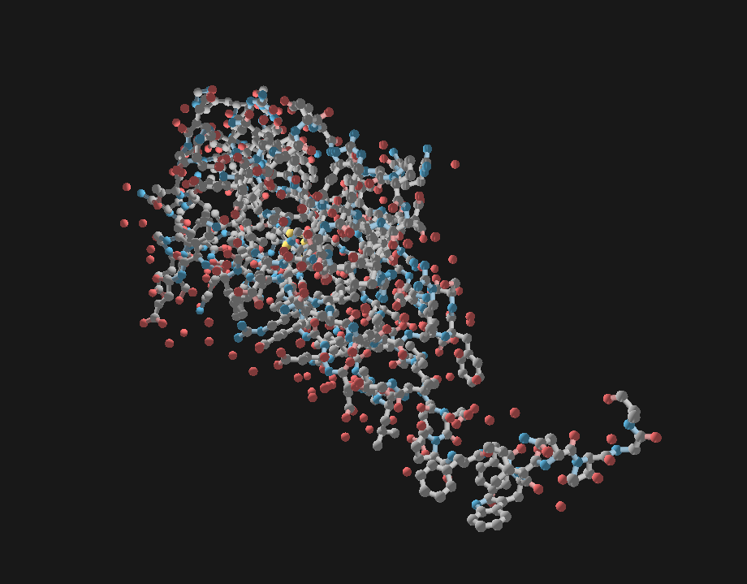

# Nemesis Molecular Visualization Engine

<p align="center">
    
</p>

Nemesis is a real-time molecular visualization engine built in Rust and Vulkan. It renders PDB protein structures via custom parser feeding GPU instance buffers with per-atom position, radius, and element data; originally built to visualize MOGAD-relevant proteins.

## Dependencies

- [Rust](https://rustup.rs) (stable)
- [Vulkan SDK](https://vulkan.lunarg.com/) 1.3+
- [glslc](https://github.com/google/shaderc)
- [glam] (https://github.com/bitshifter/glam-rs)

## Building

```bash
git clone https://github.com/nicholasgallina/nemesis.git
cd nemesis
cargo run
```
